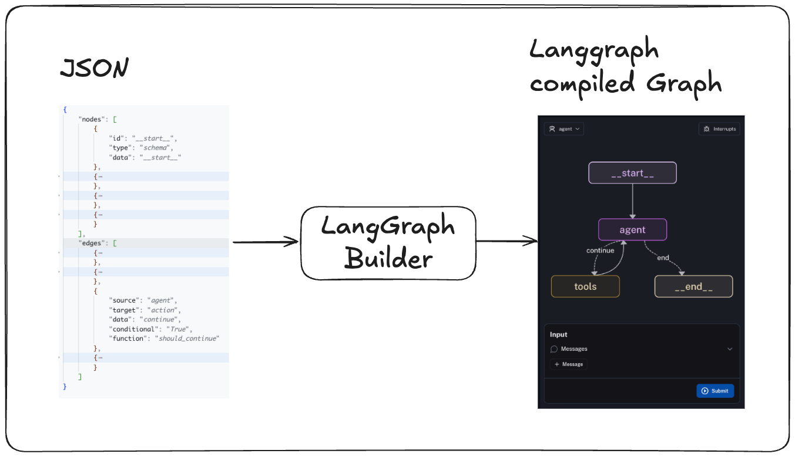

# LangGraph Builder (Work In Progress)

Build your langgraphs declaratively instead of imperatively (e.g. from a JSON file)

---

The relevant code is in `langgraph_from_json.py`

---

### Ideal for:

- Tools trying to build low-code builders/managers for LangGraph.
- Tools trying to build graphs dynamically based on a usecase
  (much more)

Work in progress, feel free to PR and contribute

---

### Resources

https://python.langchain.com/api_reference/core/runnables/langchain_core.runnables.graph.Graph.html#langchain_core.runnables.graph.Graph.to_json
https://python.langchain.com/docs/how_to/inspect/
https://github.com/langchain-ai/langgraph/discussions/1651
https://github.com/langchain-ai/langgraph-example
